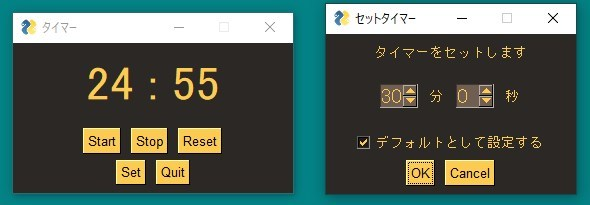
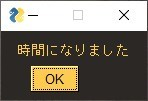

# タイマーを作ってみた
## 作成時の環境
Windows10  
Python 3.10.0  
PySimpleGUI 4.56.0
## 概要
PythonでGUIアプリを作ってみたいと思い、タイマーを作成しました。

使用には、Python3.4以上と、パッケージ「PySimpleGUI」がインストールされていることを前提としています。  
※自分の環境以外での動作確認は行っていません。

スタート・ストップ・リセット・セット機能を付け、タイマーのセット時間は、最大60分59秒まで設定可能です。
## 使い方
PowerShellやターミナルなどから「timer_gui.py」をPythonで実行してください。アプリが起動します。

「Set」でタイマーに指定する時間を設定します。

その際「デフォルトとして設定する」にチェックを入れると、「user_set.txt」ファイルが作成され、数値が保存されます。

次回以降セットの必要がなくなります。

時間が来たらポップアップがお知らせします。

